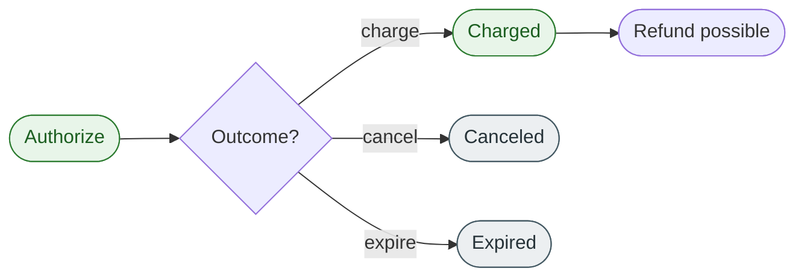

# Authorize a payment

## What is an authorization?

<!-- --8<-- [start:authorize-intro] -->
An **authorization** is a temporary hold on the customer's funds without actually transferring them. The customer's available balance reduces by the authorized amount, but the money stays in their account until the merchant either **charges** the authorization (capturing the funds) or **cancels** it (releasing the hold).

An authorization is the first step in a two-step payment flow. Use it when you need to verify the customer can pay, but you are not yet ready to take the money — for example, while you confirm stock, complete fraud review, or wait for the order to ship.
<!-- --8<-- [end:authorize-intro] -->

## When to authorize

Authorize a payment when:

- You want to confirm funds before shipping a product in your **ecommerce** shop.
- You are taking a **hotel, rental, or deposit hold** that may or may not become a charge.
- You need to **fraud review window** between checkout and capture.
- Your fulfilment is asynchronous and you don't know the final amount yet (within the authorized ceiling), such as post-paid phone contracts.

If you intend to take the money immediately and have nothing to verify, use a **direct charge** instead — it combines authorize + charge into one call.

## Where authorization fits in the payment lifecycle

An authorization has a finite life. If it is neither charged nor canceled, the network expires the hold automatically — typically after 7 days for cards, though this varies by network and issuer.

## Authorization states

| State | Meaning |
| ----- | ------- |
| `pending` | Authorization request accepted; awaiting the issuer's response |
| `succeeded` | Funds successfully held on the customer's payment method |
| `failed` | The issuer declined the authorization (insufficient funds, blocked card, fraud rule) |
| `expired` | The authorization aged out before it was charged or canceled |
| `canceled` | The authorization was explicitly released by the merchant |

## Constraints

- **Idempotency keys are required** on `POST /v1/authorizations`. A expired authorization without one can place two holds on the same card.
- **Time-bounded.** Authorizations expire automatically — usually within 7 days for cards. Check the `expires_at` field on the response.
- **Capturable amount is fixed.** You can charge any amount **up to** the authorized total, but never more. To increase, void and re-authorize.
- **Currency is locked at authorization time.** A subsequent charge or refund must use the same currency.

## Example

A customer places a $100.00 USD ecommerce order on 2026-05-01. The merchant authorizes the full $100.00 immediately but does not yet charge.

1. Send a `POST /v1/authorizations` for `$100.00 USD` against the customer's card.
2. The API returns `authorization.status = "pending"` and an authorization ID prefixed `auth_`.
3. Within seconds the issuer responds and the state moves to `succeeded`. The hold is now in place; the customer's available balance is $100.00 lower.
4. On 2026-05-03 the warehouse ships the order. The merchant charges the authorization ([Charge a payment](charge-overview.md)) and the funds move to the merchant.

## What's not on this page

This page does not cover **how** to call the authorization endpoint, the dashboard view of pending authorizations, or merchant settlement. Those live in the task topics and the API reference.

## Related links

- [Charge a payment](charge-overview.md)
- [Cancel a payment](cancel-overview.md)
- [Refund a payment](refund-overview.md)
