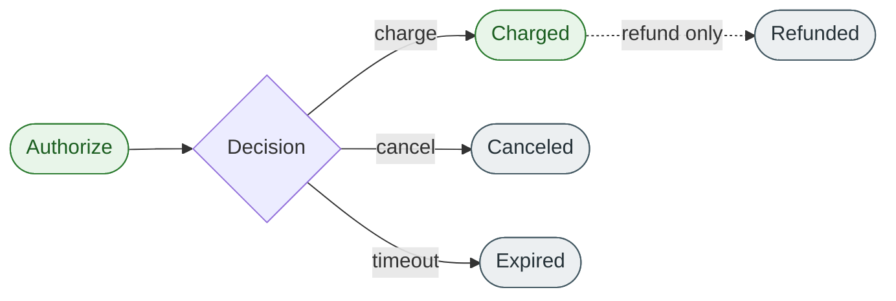

# Cancel a payment

## What is a cancellation?

<!-- --8<-- [start:cancel-intro] -->
A **cancel** releases a previously authorized hold on the customer's payment method **before** the funds are charged. It moves no money — it simply tells the network that the merchant will not be capturing the authorization, and the customer's available balance returns to its pre-authorization state.

Cancel is **not** a refund. Refunds return funds that have already been charged; cancels release funds that have only been held. Once a payment has been **charged**, cancel is no longer available — you must issue a [refund](refund-overview.md) instead.
<!-- --8<-- [end:cancel-intro] -->

## When to cancel

Cancel a payment when:

- The customer cancels the order **before** you ship or fulfil.
- A fraud rule fires after authorization and you don't want to capture.
- You authorized more than you ultimately need to charge, and you want to release the surplus immediately rather than waiting for the network to expire it.
- The order failed validation (out of stock, address invalid) before charge.

If the payment has already been **charged**, cancel will be rejected — issue a [refund](refund-overview.md) instead.

## Where cancellation fits in the payment lifecycle

Cancel is **free** and **near-instant**. There is no settlement cost, no fee, and the customer's available balance is restored as soon as their bank processes the release — usually within minutes, occasionally up to one business day depending on the issuer.

## Cancel vs refund — at a glance

| | Cancel | Refund |
| --- | ------ | ------ |
| **What it does** | Releases a hold | Returns charged funds |
| **Allowed when** | Payment is **authorized only** | Payment is **charged** |
| **Cost to merchant** | None | Sometimes a small processing fee |
| **Time to customer** | Minutes to ~1 business day | 3–10 business days |
| **Reversible?** | No — re-authorize if needed | No — issue a new charge if needed |

## Cancel states

| State | Meaning |
| ----- | ------- |
| `pending` | Cancel request accepted; awaiting confirmation from the issuer |
| `succeeded` | The hold has been released |
| `failed` | The cancel was rejected — usually because the authorization had already been charged or had expired |

## Constraints

- **Idempotency keys are required** on `POST /v1/cancels`. A retried cancel without one is harmless but can be confusing in audit logs.
- **The payment must be authorized but not charged.** Charged payments cannot be canceled — refund instead.
- **Cancel cannot be partial.** A cancel always releases the entire authorized amount. To capture less than authorized, do a partial charge — the remainder will expire or can be canceled.
- **Once canceled, an authorization cannot be reinstated.** Re-authorize from scratch.

## Example

Continuing the example from [Authorize a payment](authorize-overview.md): the merchant authorized **$100.00 USD** on 2026-05-01 against payment `pay_01HABCDEF12345`. On 2026-05-02 the customer cancels the order before it ships.

1. The developer calls `POST /v1/cancels` against authorization `auth_01HXYZ…`.
2. The API returns `cancel.status = "pending"` and a cancel ID prefixed `cnl_`.
3. Within seconds the issuer confirms and the state moves to `succeeded`.
4. The customer's available balance returns to its pre-authorization level — usually within minutes, occasionally by the next business day.
5. No money has moved; no refund is needed; no fee is incurred.

## What's not on this page

This page does not cover **how** to call the cancel endpoint, the dashboard view of canceled holds, or partial captures (which leave a remainder that may need to be canceled separately). Those live in the task topics and the API reference.

## Related links

- [Authorize a payment](authorize-overview.md)
- [Charge a payment](charge-overview.md)
- [Refund a payment](refund-overview.md)
