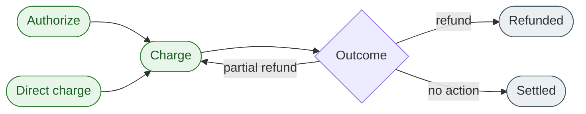

# Charge a payment

## What is a charge?

<!-- --8<-- [start:charge-intro] -->
A **charge** moves funds from the customer's payment method to the merchant's settlement account. It is the operation that actually takes the money. A charge can either capture a previous **authorization** (two-step flow) or authorize-and-capture in a single call (direct charge).

A successful charge is the prerequisite for any later **refund** — funds that have not been charged cannot be refunded; an unwanted authorization is **canceled** instead.
<!-- --8<-- [end:charge-intro] -->

## When to charge

Charge a payment when:

- you have a prior authorization and the order is now ready to fulfil (most common ecommerce flow).
- you want a single-step **authorize + capture** because you have nothing to verify (digital goods, subscriptions, donations).
- the final amount is now known and you are ready to settle.

If you are not yet ready to take the money, use [authorization](authorize-overview.md) and charge later.

## Where the charge fits in the payment lifecycle

A charge can be **full** (the entire authorized amount) or **partial** (any amount up to the authorized ceiling). If you authorized $100 and only ship $80 of goods, you can charge $80 and let the remaining $20 hold expire — or cancel it explicitly.

## Charge types

| Type | What it does | When to use |
| ---- | ------------ | ----------- |
| **Capture (against authorization)** | Takes funds previously authorized | Two-step flow: ecommerce, marketplace, asynchronous fulfilment |
| **Direct charge** | Authorizes and captures in one call | One-step flow: digital goods, donations, subscriptions |
| **Partial capture** | Captures less than the authorized amount | Order ships partially or final amount is below the hold |

## Charge states

| State | Meaning |
| ----- | ------- |
| `pending` | Charge request accepted; awaiting confirmation from the network |
| `succeeded` | Funds have moved to the merchant's settlement account |
| `failed` | The capture was rejected — usually because the authorization expired or was canceled |
| `partially_refunded` | One or more refunds have been issued but the cumulative refund total is less than the captured amount |
| `refunded` | The full captured amount has been refunded |

## Constraints

- **Idempotency keys are required** on `POST /v1/charges`. A retried charge without one can capture funds twice.
- **Cannot charge more than authorized.** Partial captures are allowed; over-captures are rejected.
- **Cannot charge an expired or canceled authorization.** Re-authorize first.
- **Currency must match the original authorization.** Cross-currency charges are rejected.
- **Settlement is not instant.** Funds typically reach the merchant's bank account in 1–3 business days, depending on the schedule.

## Example

Continuing the example from [Authorize a payment](authorize-overview.md): a customer was authorized for **$100.00 USD** on 2026-05-01 against payment `pay_01HABCDEF12345`. On 2026-05-03 the warehouse ships only one of two items.

1. The developer calls `POST /v1/charges` for `$80.00 USD` against authorization `auth_01HXYZ…`.
2. The API returns `charge.status = "pending"` and a charge ID prefixed `chg_`.
3. Within seconds the network confirms and the state moves to `succeeded`.
4. The remaining `$20.00` of the authorization is left to expire (or canceled explicitly via [Cancel a payment](cancel-overview.md)).
5. The customer sees an `$80.00` debit on their card statement within 1–3 business days.

## What's not on this page

This page does not cover **how** to call the charge endpoint, settlement reporting, or fee calculation. Those are available in the task topics and the API reference.

## Related links

- [Authorize a payment](authorize-overview.md)
- [Cancel a payment](cancel-overview.md)
- [Refund a payment](refund-overview.md)
