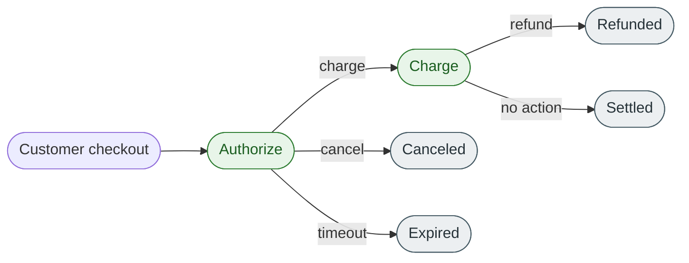

# Payment operations at a glance

*Concept · For developers · Foundational*

PayCart's payment lifecycle is built from four operations. Each one has a single, narrow job. Choosing the right one is almost always determined by **what state the payment is currently in** — not by what the merchant wants to happen.

## The lifecycle in one diagram

A payment can only move along the arrows. The most common sources of bugs in payment integrations come from trying to issue the wrong operation for the current state — for example, refunding an authorization (use cancel) or canceling a charge (use refund).

## The four operations

### Authorize a payment

--8<-- "concept-topics/authorize-overview.md:authorize-intro"

→ Read the full concept: [Authorize a payment](authorize-overview.md).

### Charge a payment

--8<-- "concept-topics/charge-overview.md:charge-intro"

→ Read the full concept: [Charge a payment](charge-overview.md).

### Cancel a payment

--8<-- "concept-topics/cancel-overview.md:cancel-intro"

→ Read the full concept: [Cancel a payment](cancel-overview.md).

### Refund a payment

--8<-- "concept-topics/refund-overview.md:refund-intro"

→ Read the full concept: [Refund a payment](refund-overview.md).

## Choose the right operation

| If the payment is… | And you want to… | Use |
| ------------------ | ---------------- | --- |
| Not yet started | Hold funds before fulfilment | [Authorize](authorize-overview.md) |
| Authorized | Take the money | [Charge](charge-overview.md) |
| Authorized | Release the hold without taking money | [Cancel](cancel-overview.md) |
| Charged | Return some or all of the money | [Refund](refund-overview.md) |
| Charged | Release the money — *not possible* | (Refund is the only path back) |
| Expired or canceled | Try again | Authorize from scratch |

## What's not on this page

This page does not cover **how** to call the API for any operation, dashboard verification, settlement, or fee handling. Each linked concept page covers its own constraints and example; the task topics under [Refund workflow](../refund-workflow/index.md) cover the procedural detail for one end-to-end flow.

## Related links

- [Authorize a payment](authorize-overview.md)
- [Charge a payment](charge-overview.md)
- [Cancel a payment](cancel-overview.md)
- [Refund a payment](refund-overview.md)
- [Refund workflow — end-to-end](../refund-workflow/index.md)
