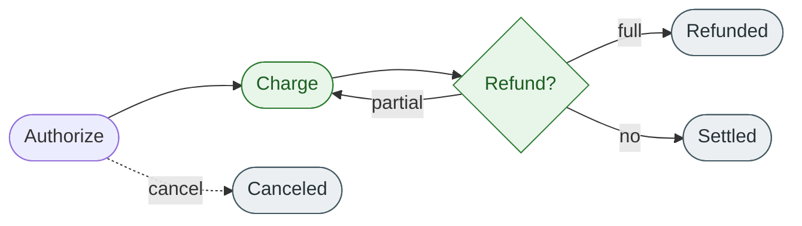

# Refund a payment

## What is a refund?

<!-- --8<-- [start:refund-intro] -->
A **refund** returns funds to the customer against a payment that has already been **charged**. A refund can be for the full charged amount or a partial amount, and a single charge can have multiple partial refunds — provided the cumulative refund total never exceeds the captured amount.

Refunds are the only operation in the payment lifecycle that move money *back* to the customer through the merchant's own initiative. For money returned at the cardholder's request via their bank, see *Manage disputes* — that is a chargeback, not a refund.
<!-- --8<-- [end:refund-intro] -->

## When to refund

Issue a refund when:

* The customer returned a product or canceled an order.
* A charge was made for the wrong amount.
* A service was not delivered.
* A duplicate charge needs to be reversed *after* it has been captured.

If the payment has only been **authorized** and not yet **charged**, do not refund — **cancel** the authorization instead. Cancellation is free and instant; refunds move real funds and take 3–10 business days to reach the customer.

## Where a refund fits in the payment lifecycle

A refund is only valid against a payment in the **charged** state. Issuing one creates a new linked resource (`refund`) and decreases the original payment's `remaining_refundable_amount`. When that amount reaches zero, the payment moves to **refunded**.

## Refund types

| Type | What it does | When to use |
| ---- | ------------ | ----------- |
| **Full refund** | Returns the entire captured amount in one operation | Customer returned everything; order fully canceled after charge |
| **Partial refund** | Returns part of the captured amount; the payment stays refundable for the remainder | Partial return; restocking fee retained; goodwill adjustment |
| **Multiple partials** | Several partial refunds against the same payment, summed | Returns trickle in over time (e.g., a multi-item order) |

## Refund states

| State | Meaning |
| ----- | ------- |
| `pending` | Accepted by the processor; funds have not yet moved |
| `succeeded` | Funds have been returned to the customer |
| `failed` | Terminal failure — usually a closed or invalid card on file. Funds remain with the merchant |
| `canceled` | Refund was canceled before completing |

A refund cannot move from `succeeded` back to any other state. Once succeeded, the only way to "undo" it is a new charge — which requires the customer's authorization.

## Constraints

- **Idempotency keys are required.** A retried refund without one can return the same money twice. See [Before you begin](../refund-workflow/before-you-begin.md).
- **Currency must match.** A refund is always in the original payment's currency; cross-currency refunds are rejected.
- **Time-bounded.** Most processors allow refunds for up to 180 days after the original charge. After that, the refund must be issued as a new payment to the customer.
- **The payment must be charged, not just authorized.** Authorized-but-not-charged payments are reversed via cancel, not refund.

## Example

A customer is charged **$100.00 USD** on 2026-05-01 against payment `pay_01HABCDEF12345`. On 2026-05-03 they return one of two items and request a partial refund of **$25.00**.

1. The developer creates a refund for `$25.00` against `pay_01HABCDEF12345`.
2. The API returns `refund.status = "pending"` and a refund ID prefixed `rfd_`.
3. Within seconds the processor confirms the refund and the state moves to `succeeded`.
4. The original payment now shows `remaining_refundable_amount = 7500` (cents) and `state = "partially_refunded"`.
5. The customer sees the $25.00 credit on their card statement within 3–10 business days.

## What's not on this page

This page does not cover **how** to call the refund endpoint, the dashboard verification step, or the finance reconciliation step. Those live in the task topics and the API reference.

## Related links

- [Authorize a payment](authorize-overview.md)
- [Charge a payment](charge-overview.md)
- [Cancel a payment](cancel-overview.md)
- [Refund workflow — end-to-end](../refund-workflow/index.md)
